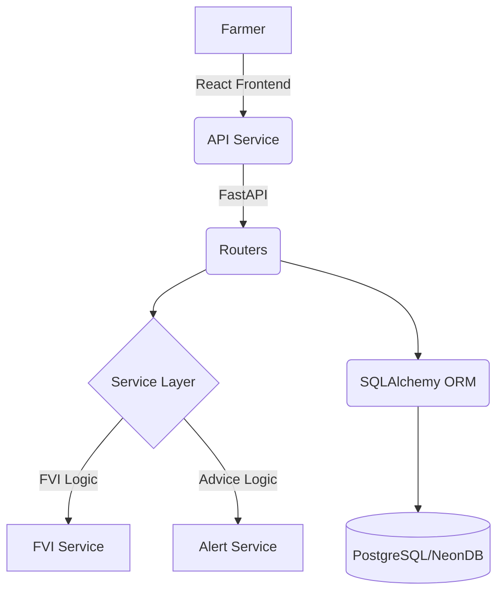

# GraamAI: Rural Intelligence Platform - Project Overview

## 🌾 Project Vision
GraamAI is a specialized AI platform designed to empower rural farmers by providing data-driven agricultural insights. The system calculates the **Farmer Vulnerability Index (FVI)** and generates personalized advice in local languages to help mitigate agricultural risks.

---

## 🚀 Tech Stack

### Backend (Python/FastAPI)
- **Framework**: FastAPI for high-performance Async APIs.
- **Database**: PostgreSQL (hosted on NeonDB) with SQLAlchemy ORM.
- **Logic**: Custom services for FVI calculation and rural advice generation.
- **Environment**: Python-dotenv for secure configuration.

### Frontend (React/Vite)
- **Framework**: React with Vite for a fast, modern development experience.
- **Styling**: Vanilla CSS with a focus on "Glassmorphism" and premium rural aesthetics.
- **Icons**: Custom SVG icons for low-bandwidth environments.
- **State Management**: React Hooks and LocalStorage for simple session handling.

---

## 🛠️ Features Implemented

### 1. Robust Authentication & Registration
- Farmer registration with detailed profiles (Location, Crop, Land Size, Income).
- Optional profile photo upload (Base64 storage for v1 simplicity).
- Secure-ready login flow (Plaintext passwords for prototype v1).

### 2. Intelligent Agricultural Engine
- **Crop Database**: Pre-seeded with common rural crops (Cotton, Rice, Wheat, Groundnut) including their seasonal and risk profiles.
- **FVI Calculator**: Dynamic scoring based on water requirements, seasonality, and farmer-specific land/income data.
- **Rural Alerts**: Automated advice generation tailored to the farmer's risk level.

### 3. Premium UI/UX
- **Responsive Design**: Fluid layouts that look stunning on both mobile and desktop.
- **Glassmorphism Theme**: Emerald-gradient "glass" cards for a premium, modern feel.
- **Navigation**: Persistent header with profile access and integrated "Back" buttons.
- **Localized Content**: Support for Gujarati advice (English being added).

---

## 📁 System Architecture

---

## 📍 Current Status: Phase 1 Finalization
The platform is currently fully functional as a v1 prototype. The next immediate steps involve finalizing multi-language localization (English/Gujarati toggle) and further refining the registration experience.
