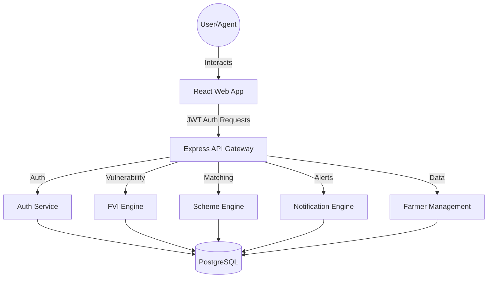

# 🌾 KhedutMitra: Rural Intelligence Platform (v1.2)

KhedutMitra is a specialized rural intelligence platform designed to empower rural communities, institutions, and field agents with data-driven insights. By leveraging multi-dimensional data, KhedutMitra provides actionable intelligence for farmer vulnerability assessment, government scheme matching, and real-time risk alerting.

## ✨ What's New in v1.2
- **🌐 Triple-Language Support**: Full localization for English, Hindi, and Gujarati.
- **🛰️ Live Weather Engine**: Real-time temperature and rainfall data via Open-Meteo integration.
- **🧠 5-Dimension FVI**: Advanced weighted risk scoring including Soil, Water, Heat, Market, and Pest factors.
- **⚡ Proactive Caching**: Optimized backend synchronization for instant data refreshes.

## 🚀 Key Features

-   **📊 Farmer Vulnerability Index (FVI)**: A comprehensive 5-dimension scoring system with weighted risk assessment.
-   **🗣️ Multilingual Support**: Full localized interface for English, Hindi, and Gujarati, including dynamic content translation.
-   **🌤️ Live Weather Intelligence**: Real-time temperature and rainfall data integration with proactive backend caching.
-   **🤝 Smart Scheme Matching**: AI-driven engine that matches farmers with eligible government schemes and subsidies.
-   **🗺️ Vulnerability Heatmap**: Interactive geospatial visualization of risk distribution (powered by D3.js).
-   **🔔 Real-time Alerts**: Automated notifications for pest outbreaks, weather anomalies, and market fluctuations.
-   **👨‍🌾 Farmer Management**: 360-degree profiles including crop history, land details, and financial status.

## 🛠️ Tech Stack

### 💻 Frontend
-   **⚛️ Core**: React 18 (Vite)
-   **📦 State Management**: Zustand (with Persist middleware)
-   **📡 Data Fetching**: TanStack Query (React Query) v5
-   **🎨 Styling**: Vanilla CSS & Tailwind CSS
-   **✨ Animations**: Framer Motion
-   **📈 Charts & Maps**: Recharts, D3.js, React Leaflet

### 🏗️ Backend
-   **🟢 Core**: Node.js, Express.js
-   **🗄️ Database**: PostgreSQL
-   **🔑 Authentication**: JWT (JSON Web Tokens)
-   **🛡️ Validation**: Joi
-   **📝 Logging**: Morgan & custom audit logger

### 🔌 External Integrations
-   **🌦️ Open-Meteo**: Powering high-resolution local weather data.
-   **🔤 Azure AI Translator**: Enabling real-time dynamic translation of farmer data.

## 📐 System Design

### 🛰️ Architecture Overview
KhedutMitra follows a decoupled client-server architecture. The frontend communicates with a RESTful API backend, which interfaces with a PostgreSQL database.



### 🔄 Data Flow (FVI & Weather)
1.  **📥 Input**: Field agent updates farmer data or a detail page is requested.
2.  **🧠 Intelligence**: Backend triggers a weather fetch (Open-Meteo) if cache is missing/stale.
3.  **⚙️ Engine**: FVI Service applies weighted risk formulas across 5 environmental and social dimensions.
4.  **🔤 Translation**: UI components use `useLanguage` hook and Azure API to present data in the user's preferred language.
5.  **📤 Output**: Real-time score breakdown and weather cards displayed on the dashboard and detail views.

## 📁 Project Structure

```text
GenAI-Rural_Intelligence_Platform/
├── backend/                # Express.js Server
│   ├── src/
│   │   ├── config/         # DB and environment config
│   │   ├── db/             # Migrations and Seed files
│   │   ├── middleware/     # Auth, Error handling, Rate limiting
│   │   ├── modules/        # Feature-based logic (Auth, Farmers, Alerts, etc.)
│   │   └── utils/          # Helpers (API Response, Logger)
│   └── server.js           # Entrance point
├── frontend/               # React Application (Vite)
│   ├── src/
│   │   ├── api/            # Axios instance and API calls
│   │   ├── components/     # UI and Feature-based components
│   │   ├── hooks/          # Custom hooks (Auth, Farmers, Queries)
│   │   ├── pages/          # Main route components
│   │   ├── store/          # Zustand state stores
│   │   └── utils/          # Constants and Formatters
│   └── vite.config.js
└── README.md
```

## ⚙️ Installation & Setup

### 📋 Prerequisites
-   Node.js >= 20.0.0
-   PostgreSQL Database

### 💻 Backend Setup
1.  Navigate to `/backend`.
2.  Install dependencies: `npm install`.
3.  Configure `.env` file:
    ```env
    PORT=3000
    DATABASE_URL=your_postgres_url
    JWT_SECRET=your_jwt_secret
    ```
4.  Run migrations & seed: `npm run migrate` then `npm run seed`.
5.  Start dev server: `npm run dev`.

### 🖥️ Frontend Setup
1.  Navigate to `/frontend`.
2.  Install dependencies: `npm install`.
3.  Configure `.env` file:
    ```env
    VITE_API_BASE_URL=http://localhost:3000/api
    ```
4.  Start dev server: `npm run dev`.

## 🔒 Security
-   🛡️ JWT for secure stateless authentication.
-   🌐 CORS enabled for specific origins.
-   🚦 Rate limiting on API endpoints to prevent abuse.
-   🔐 RBAC (Role-Based Access Control) for Institution Users and Admins.

---
© 2026 KhedutMitra Rural Intelligence Platform. All rights reserved. 🌾
